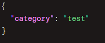
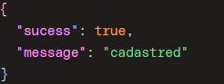
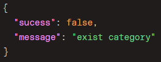
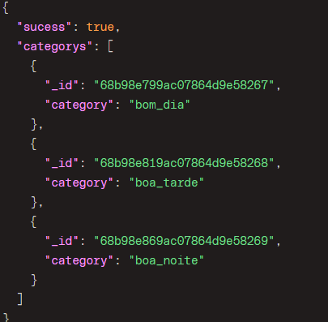
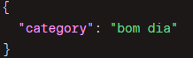
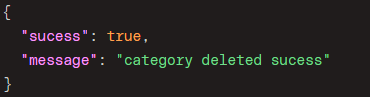
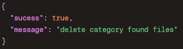
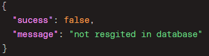

# .env
- DATABASE_URL

# message day api

## Install and started

1. npm i
2. npm run dev

## Test
1. npm i
2. npx prisma migrate reset
3. npm run test

## Routers ☁️

### Category
- [category/add](#categoryadd)
- [category/all](#categoryall)
- [category/delete](#categorydelete)

### Image
- image/upload
- image/count
- image/all/:category/:page
- image/delete
- image/download/:id

### Message
- message/add
- message/all/:category/:page
- message/count
- message/new/now
- message/delete/:id
- message/view/now

 

# Introdução as Rotas
## Category/add
Rota responsavel por adicionar uma categoria .

🏷️ **POST**

Rota precisa que seja enviado pelo corpo da Requisição **Body**

Resposta do cadastro com sucesso

Resposta se a categoria ja foi cadastrada

## category/all

Rota responsavel por mostrar todas as rotas cadastradas

🏷️ **GET**

## category/delete

Rota responsavel por remover a categoria cadastrada

🏷️ **DELETE**

Rota precisa que seja enviado pelo corpo da Requisição **Body**

Resposta se ja foi associada alguma imagem a essa categoria

se a categoria foi criada com o intuido de teste ou ate mesmo com algum error de escrita ela pode ser excluida porem a Resposta vai ser outra

se tentar excluir a categoria que não existe 

