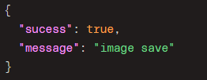
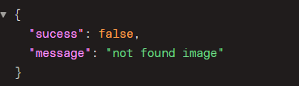
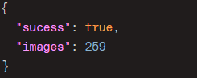
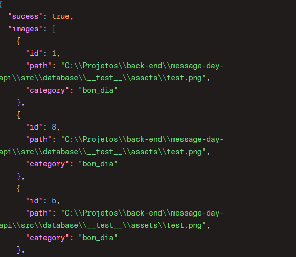
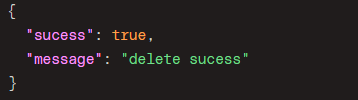
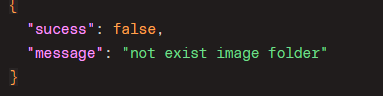

# .env
- DATABASE_URL

# message day api

## Install and started

1. npm i
2. npm run dev

## Test
1. npm i
2. npx prisma migrate reset
3. npm run test

## build
1. npm i
2. npm run build

## Routers ☁️

### Image
- image/upload
- image/count
- image/all/:category/:page
- image/delete
- image/download/:id

### Message

### Category

### 🏷️ image/upload

**Method : post**

⬆️ **Request**

- 🖼️ **image** = path image
- 🟰 **category** = name category

⬇️ **Response**

✅ ***sucess***

❌ ***lock of category***

❌ ***lock of image***

### 🏷️ image/count
**Method : get**

✅ ***sucess***

### 🏷️ image/all/:category/:page

⬆️ **Request**
 - 🟰 category = name category
 - 📖 page = number page 

 ✅ ***sucess***

 

 ### 🏷️ image/delete

 ⬆️ **Request**

 ✅ ***sucess***

 

 ❌ ***image not found***

 

❌ ***image not registred in database***

 

